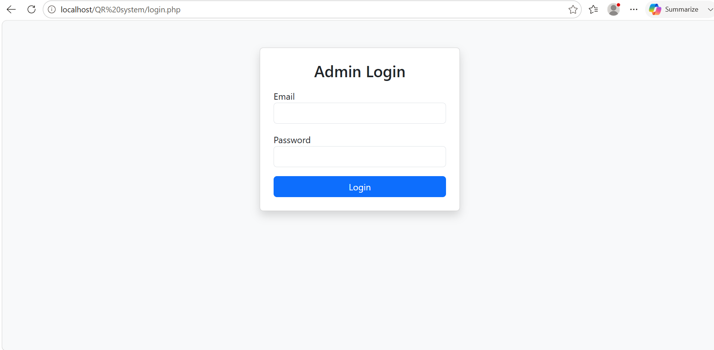
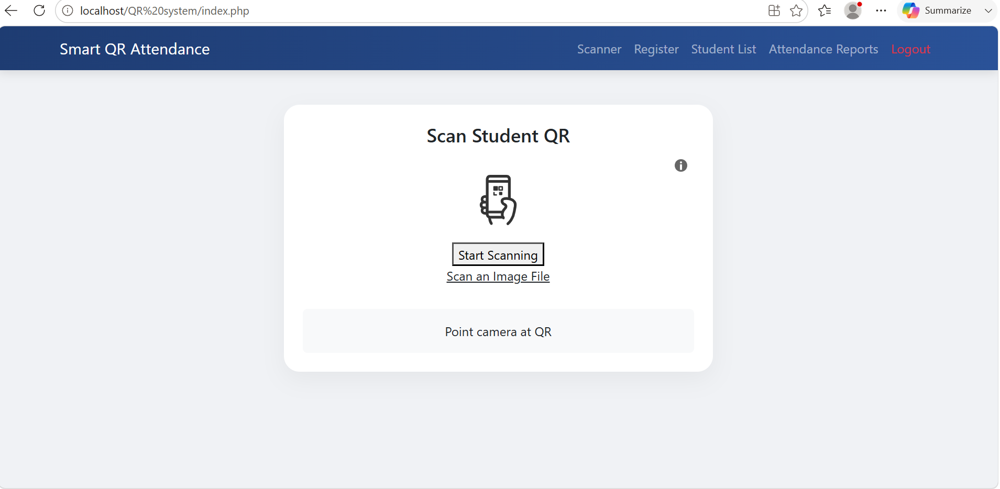
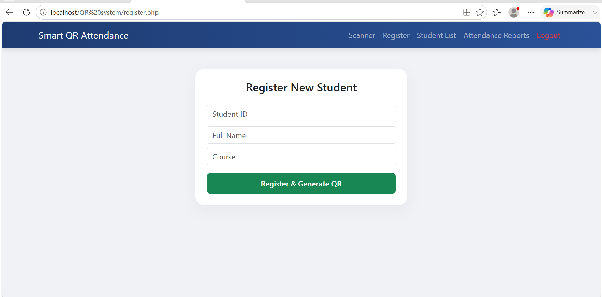
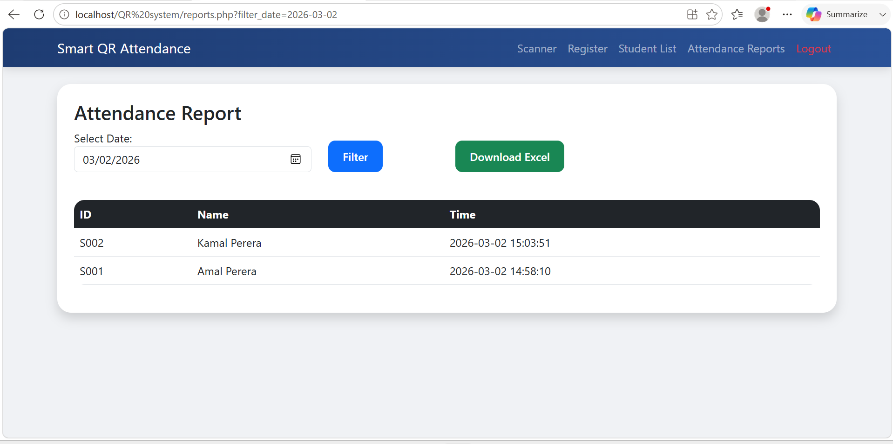
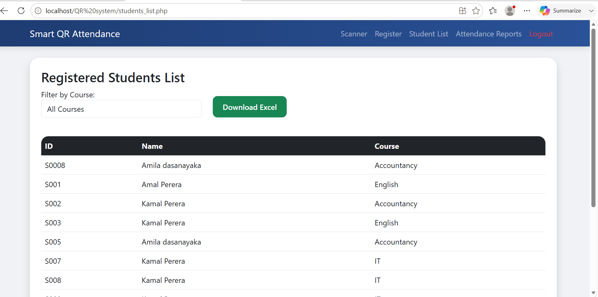

# 🎓 Smart QR Attendance System

A web-based Student Attendance Management System developed using PHP and MySQL that uses QR Code technology to automate attendance marking quickly and accurately.

---

## 📖 Overview

The Smart QR Attendance System is designed to replace manual attendance processes with a QR code scanning solution. Students can be registered into the system, receive a unique QR code, and mark their attendance by scanning it. The system also provides attendance reports and student management features.

---

## ✨ Features

- 🔐 Secure Admin Login
- 👨‍🎓 Student Registration
- 📱 Automatic QR Code Generation
- 📷 QR Code Attendance Scanning
- 📊 Daily Attendance Reports
- 📅 Filter Attendance by Date
- 📥 Export Reports to Excel
- 📋 Student List Management
- 🌐 Progressive Web App (PWA) Support
- 📱 Responsive User Interface

---

## 🛠️ Technologies Used

- PHP
- MySQL
- HTML5
- CSS3
- Bootstrap 5
- JavaScript
- HTML5 QR Code Scanner

---

## 📂 Project Structure

```
smart-qr-attendance-system/

|──Screenshots
│── index.php
│── login.php
│── register.php
│── reports.php
│── students_list.php
│── log_attendance.php
│── logout.php
│── db.php
│── header.php
│── style.css
│── manifest.json
│── sw.js
│── database.sql
```

---

## ⚙️ Installation Guide

1. Clone or download this repository.
2. Move the project to the `htdocs` folder in XAMPP.
3. Open phpMyAdmin.
4. Create a database named `attendance_db`.
5. Import the `database.sql` file.
6. Update database credentials in `db.php` if necessary.
7. Start Apache and MySQL.
8. Open your browser and visit:

```
http://localhost/smart-qr-attendance-system/
```

---

## 📸 Screenshots

### Login Page


### QR Scanner


### Student Registration


### Attendance Report


### Students Report



## 🎯 Main Modules

- Admin Authentication
- Student Registration
- QR Code Generation
- QR Code Scanner
- Attendance Management
- Attendance Reports
- Student List

---

## 💡 Future Improvements

- Email Notifications
- Teacher Accounts
- Multiple User Roles
- Dashboard Analytics
- PDF Report Generation
- Cloud Database Support

---

## 👩‍💻 Developer

**Lakshi Sewmini**

Aspiring Software Developer passionate about building practical web applications using PHP and MySQL.

---

## ⭐ If you found this project useful, please consider giving it a Star.
